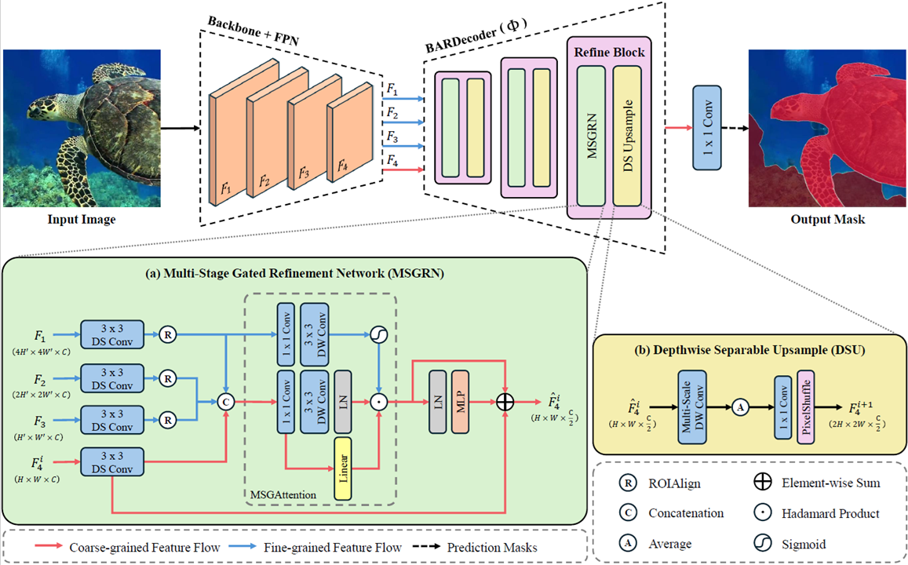
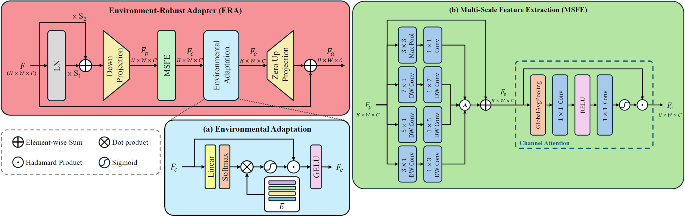
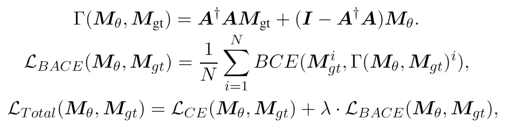

# Boundary-Aware Refinement with Environment-Robust Adapter Tuning for Underwater Instance Segmentation [ACML 2025]

This repository is the official PyTorch implementation of "[Boundary-Aware Refinement with Environment-Robust Adapter Tuning for Underwater Instance Segmentation](#acknowledgement)". By Pin-Chi Pan, Soo-Chang Pei, and has been accepted by ACML2025! 🎉🎉🎉

Our BARD-ERA achieves robust and efficient underwater instance segmentation, dynamically adapting to challenging visual conditions without incurring excessive inference overhead.


### :rocket: Highlights:
- **Boundary-Aware Refinement Decoder (BARDecoder)**: Unlike conventional feature pyramid networks, BARDecoder incorporates a Multi-Stage Gated Refinement Network (MSGRN) for hierarchical refinement and Depthwise Separable Upsampling (DSU) for efficient multi-scale feature fusion, leading to more precise mask delineation with fewer parameters.

  

- **Environment-Robust Adapter (ERA)**: ERA is inserted after each transformer or convolutional block, using lightweight modules to capture environment-specific priors. This design effectively mitigates underwater degradations such as scattering and color shifts, while reducing trainable parameters by over 90% compared to full finetuning. 
  
  

- **Boundary-Aware Cross-Entropy (BACE) loss**: To further improve boundary localization, we propose the Boundary-Aware Cross-Entropy (BACE) loss, which explicitly enhances mask quality by refining object contours.

  


## Getting Started

### Requirements
* Python 3.6+
* Pytorch 1.3+
* mmcv-full>=1.3.17, \<1.6.0 (we use [mmcv](https://github.com/open-mmlab/mmcv/tree/v1.5.3) 1.5.3 and [mmdetection](https://github.com/open-mmlab/mmdetection/tree/v2.25.1) 2.25.1 in code)

```bash
git clone https://github.com/PANpinchi/BARD-ERA.git

cd BARD-ERA
```

## Installation and Setup
### Virtual Environment
* To set up the virtual environment and install the required packages, use the following commands:
```bash
conda create -n bard_era python=3.10

conda activate bard_era

source install_environment.sh
```
* (Optional) or manually execute the following command:
```bash
# CUDA 11.3
conda install pytorch==1.12.0 torchvision==0.13.0 torchaudio==0.12.0 cudatoolkit=11.3 -c pytorch

pip install -v -e .

pip install mmcv-full==1.5.3 -f https://download.openmmlab.com/mmcv/dist/cu113/torch1.12.0/index.html

pip install opencv-contrib-python
pip install terminaltables
pip install pycocotools
pip install scikit-learn
pip install numpy==1.23.5
pip install gdown
pip install mmcls
pip install yapf==0.40.1
```

### Pre-Trained Model
* Run the commands below to download the pre-trained model:
```bash
mkdir pretrained

cd pretrained

# Swin backbone
gdown --id 1O0Qol2XT8rx8zUkukaqgVswvEKVwHmx1

# ConvNeXt v2 backbone
gdown --id 1e3h-4ji5-j0ywL5qL1NL4vRAbip-0Blr

cd ..
```
Note: `*.pth` files should be placed in the `/pretrained` folder.


### Datasets
* You can get the UIIS dataset in [Google Drive](https://drive.google.com/file/d/1MwGvsr2kJgKBGbU3zoZlXiqSSiP1ysGR/view?usp=sharing) from [WaterMask](https://github.com/LiamLian0727/WaterMask?tab=readme-ov-file).
* (Optional) or manually execute the following command:
```bash
# CUDA 11.3
cd data

gdown --id 1MwGvsr2kJgKBGbU3zoZlXiqSSiP1ysGR

unzip UIIS.zip

mv UIIS/UDW ./

rm UIIS.zip

rm -rf UIIS

cd ..
```


```bash
  data
    ├── UIIS
    |   ├── annotations
    │   │   │   ├── train.json
    │   │   │   ├── val.json
    │   ├── train
    │   │   ├── L_1.jpg
    │   │   ├── ......
    │   ├── val
```

## Training
```bash
python tools/train.py configs/_ours_/mask_rcnn_swin-b-p4-w7_fpn_1x_coco.py --work-dir [you_dir_to_save_logs_and_models] --no-validate --gpu-id [GPU_ID]
```

## Testing
```bash
python tools/test.py configs/_ours_/mask_rcnn_swin-b-p4-w7_fpn_1x_coco.py [model_checkpoint_path (.pth)] --eval segm

python tools/test.py configs/_ours_/mask_rcnn_convnext-b-p4-w7_fpn_1x_coco.py [model_checkpoint_path (.pth)] --eval segm

python tools/test.py configs/_ours_/mask_rcnn_swin-b-p4-w7_fpn_1x_coco.py pretrained/bard-era_swin_base.pth --eval segm

python tools/test.py configs/_ours_/mask_rcnn_convnext-b-p4-w7_fpn_1x_coco.py pretrained/bard-era_convnext_base.pth --eval segm
```


## Citation
* If you find our repo useful for your research, please cite us:
```
@InProceedings{pmlr-vXXX-PanPei2025bardera,
  title     = {Boundary-Aware Refinement with Environment-Robust Adapter Tuning for Underwater Instance Segmentation},
  author    = {Pan, Pin-Chi and Pei, Soo-Chang},
  booktitle = {Proceedings of The 17th Asian Conference on Machine Learning},
  year      = {2025},
  month     = {Dec},
  publisher = {PMLR},
  series    = {Proceedings of Machine Learning Research},
  volume    = {XXX},
  pages     = {---},
  url       = {https://proceedings.mlr.press/vXXX/pan25a.html}
}
```


## Acknowledgement
This software repository is implemented based on the [MMDetection](https://github.com/open-mmlab/mmdetection/tree/v2.25.1) framework and [WaterMask](https://github.com/LiamLian0727/WaterMask?tab=readme-ov-file). Please also follow their licenses. Thanks for their awesome works.
